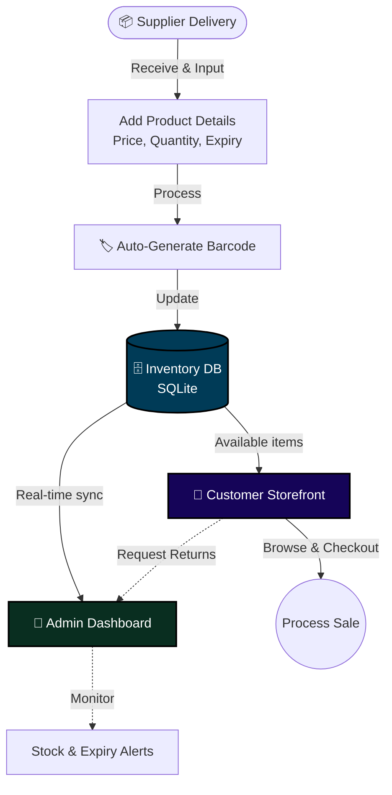
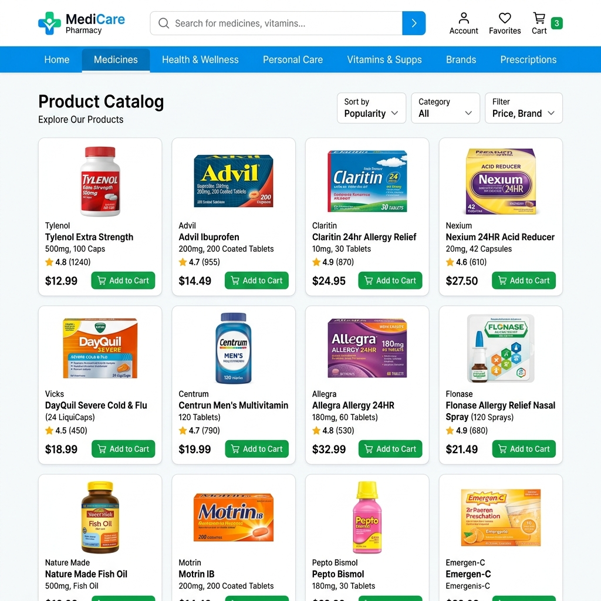
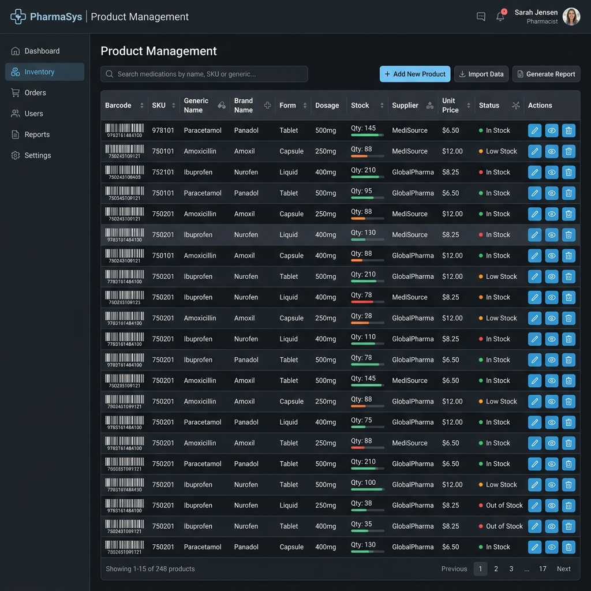
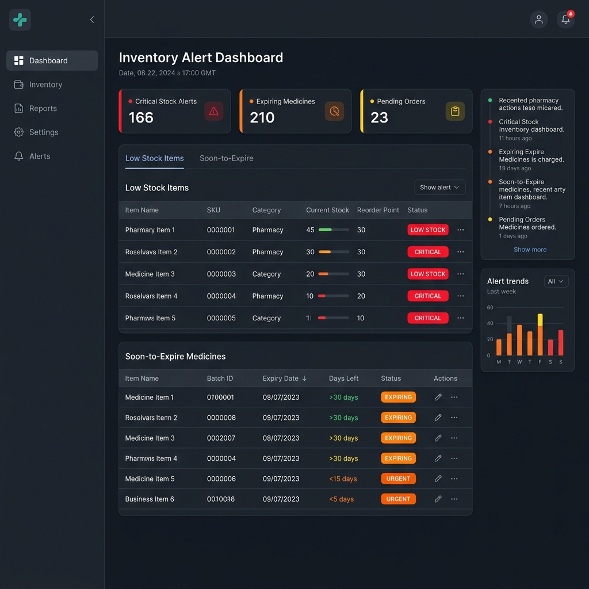

# 💊 PharmaStock

> **A comprehensive Django-based inventory management system designed specifically to streamline daily pharmacy operations, track stock, and manage sales.**


---

## 📋 Table of Contents

- [Overview](#-overview)
- [Objectives](#-objectives)
- [Core Features](#-core-features)
- [System Architecture](#-system-architecture)
- [User Roles](#-user-roles)
- [Tech Stack](#-tech-stack)
- [Setup & Installation](#-setup--installation)
- [Usage](#-usage)
- [UI Snapshots](#️-ui-snapshots)
- [Configuration & Security](#️-configuration--security)
- [About](#-about)
- [License](#-license)

---

## 🔍 Overview

Managing a pharmacy requires precise tracking of inventory, expiration dates, and sales. **PharmaStock** is a robust Django web application built to digitize and optimize these vital processes.

From product entry to final checkout, the system provides a structured, automated workflow:

1. **Manage Products** — Add, edit, and organize medical products with detailed information including category, price, and critical expiry dates.
2. **Track Stock** — Automatically monitor stock levels and receive instant alerts for items running low.
3. **Process Sales** — A fast, streamlined checkout interface for staff and customers.
4. **Monitor Expirations** — Proactively track and identify products that are expired or nearing their expiry date to minimize financial loss and ensure patient safety.
5. **Analyze & Forecast** — Generate income reports and leverage historical data for basic sales forecasting.

The result is an efficient, safe, and data-driven environment for modern pharmacies.

---

## 🎯 Objectives

| Goal | Description |
|---|---|
| 📦 **Centralize Inventory** | Replace manual logs with a structured digital product database |
| ⏳ **Minimize Waste** | Track expiry dates proactively to prioritize stock and prevent losses |
| 🛒 **Streamline Sales** | Provide a smooth checkout process and comprehensive sales tracking |
| 📊 **Data-Driven Decisions** | Generate income reports and basic sales forecasts using historical data |
| 🏷️ **Automate Barcodes** | Auto-generate EAN-13 barcodes for effortless product scanning and management |

---

## ✨ Core Features

### 👔 For Pharmacy Staff (Admins)
- **Product Management** — Comprehensive CRUD operations for all inventory items.
- **Stock & Expiry Alerts** — Automated dashboards highlighting low-stock and soon-to-expire items.
- **Supplier Database** — Maintain active records and contact details of all medical suppliers.
- **Returns Processing** — Handle customer return requests directly from the dashboard.
- **Financial Reporting** — Generate total income reports and basic sales forecasts using Pandas.

### 👤 For Customers
- **Product Catalog** — Browse available products and check stock availability.
- **Smooth Checkout** — An efficient purchasing flow designed for speed.
- **Return Requests** — Ability to initiate a return request for purchased items.

### ⚙️ System Capabilities
- **Barcode Generation:** Automatically generates standard EAN-13 barcodes for every new product using `python-barcode`.
- **User Authentication:** Distinct, secure views and dashboards for authenticated customers and staff.
- **Image Processing:** Server-side handling and processing of product images using `Pillow`.

---

## 🏗️ System Architecture

### Overall Flow



---

## 👥 User Roles

| Role | Access Level |
|---|---|
| **Customer** | Browse products, process checkouts, request product returns |
| **Staff / Admin** | Full access to product management, suppliers, reports, and stock alerts |

> Note: Access to staff areas requires authenticated accounts with `is_staff` or `is_superuser` privileges.

---

## 🛠️ Tech Stack

| Layer | Technology |
|---|---|
| **Web Framework** | Django, Python |
| **Database** | SQLite (development, scalable to PostgreSQL) |
| **Frontend** | HTML, CSS, JavaScript |
| **Data Analysis** | Pandas (for sales forecasting) |
| **Barcode Generation**| python-barcode |
| **Image Processing** | Pillow |

---

## 🚀 Setup & Installation

> 💡 For a detailed Windows setup walkthrough, see **[INSTRUCTIONS.md](INSTRUCTIONS.md)**.

### Quick Start

**1. Clone the repository**
```bash
git clone <repository-url>
cd stock
```

**2. Create and activate a virtual environment**
```powershell
# Windows
python -m venv env
env\Scripts\activate
```

**3. Install dependencies**
```bash
pip install -r requirements.txt
```

**4. Run database migrations**
```bash
python manage.py migrate
```

**5. Create a superuser (for admin access)**
```bash
python manage.py createsuperuser
```

**6. Start the development server**
```bash
python manage.py runserver
```

The application will be available at **http://127.0.0.1:8000/**  

---

## 📖 Usage

### Staff Workflow
1. Log in to the admin panel.
2. Add new products and register your suppliers.
3. Check the dashboard daily for low-stock and upcoming expiry alerts.
4. Review generated sales forecasts to prepare upcoming purchase orders.

### Customer Workflow
1. Browse the available product catalog.
2. Add items to the cart and proceed to checkout.
3. Manage past orders and initiate returns if necessary.

---

## 🖼️ UI Snapshots

| Admin Dashboard | Customer Storefront |
| :---: | :---: |
|  |  |
| *Comprehensive view of stock alerts, expiry tracking, and sales analytics.* | *Clean product catalog and seamless checkout experience for customers.* |

| Product Management | Stock Alerts |
| :---: | :---: |
|  |  |
| *Add, edit, and organize inventory items with automated EAN-13 barcoding.* | *Automated alerts for low-stock and soon-to-expire items to minimize waste.* |

---

## 🛡️ Configuration & Security

> ⚠️ **Before deploying to production, review all of the following:**

| Setting | Default | Recommendation |
|---|---|---|
| `DEBUG` | `True` | Set to `False` and configure `ALLOWED_HOSTS` |
| `SECRET_KEY` | Hardcoded | Rotate and load from environment variable |
| Database | SQLite | Migrate to PostgreSQL for concurrent usage |
| Media Files | Local `media/` | Move to a robust storage solution (e.g., AWS S3) |

**Recommended:** Use environment variables or a `.env` file to manage all secrets before going live.

---

## 📁 Project Structure

```text
📦 stock/
├── 📂 inventory/         # Main application
│   ├── 📁 migrations/    # Database migrations
│   ├── 📁 templates/     # HTML templates
│   ├── 🐍 models.py      # Database models
│   ├── 🐍 urls.py        # URL routing for the app
│   └── 🐍 views.py       # Application logic
├── ⚙️ stocktime/         # Django project configuration
│   ├── 🐍 settings.py    # Project settings
│   └── 🐍 urls.py        # Root URL configuration
├── 🎨 static/            # Static files (CSS, JS, images)
├── 🖼️ media/             # User-uploaded files (product images, barcodes)
├── 🛠️ manage.py          # Django's command-line utility
└── 🗄️ db.sqlite3         # SQLite database
```

---

## 🧑💻 About

### The Project

**PharmaStock** was developed to solve the critical inventory challenges faced by local pharmacies, replacing error-prone manual tracking with an automated, data-driven approach.

### Key Design Decisions

- **Automated Barcoding** — Ensures every product can be rapidly scanned during checkout or inventory checks without manual label creation.
- **Predictive Restocking** — Leveraging historical sales data via Pandas to provide actionable insights on when to reorder stock.
- **Safety First** — Highlighted alerts for approaching expiry dates ensure patient safety is prioritized and financial waste is minimized.

---

## 📄 License

This project is licensed under the **MIT License** — see the [LICENSE](LICENSE) file for full details.